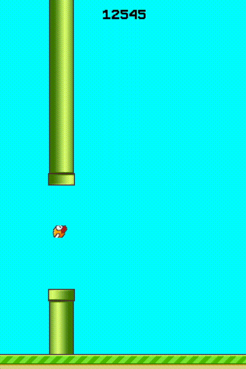

# Tidy Flappy Bird

While in a lockdown, I decided to implement the algorithm first proposed in the original paper on [Evolving Neural Networks through
Augmenting Topologies](http://nn.cs.utexas.edu/downloads/papers/stanley.ec02.pdf) commonly referred as NEAT. 

As a challenge for the agent I've also implemented a Flappy Bird clone for the AI to master.

##### Disclaimer
The code han't been cleaned up, tested, optimised or intended to be shared at all.
